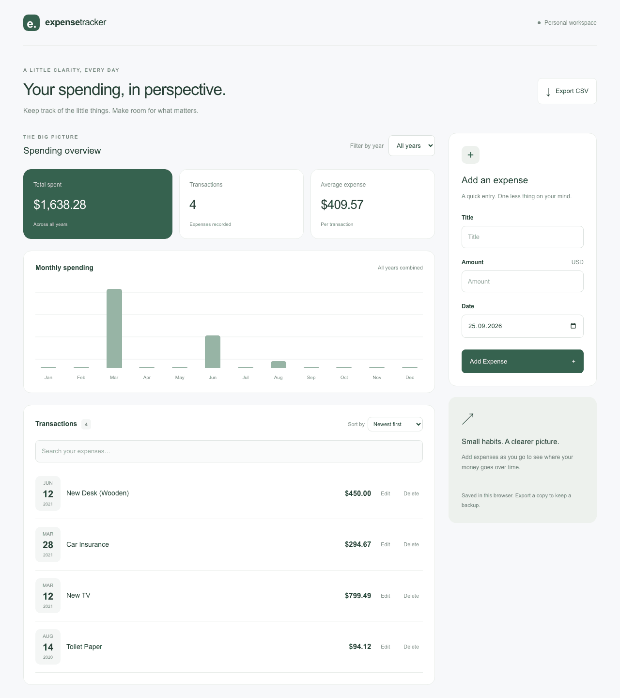

# Expense Tracker

[](https://github.com/fatmakahveci/react-expense-tracker/actions/workflows/test.yml)
[](https://nextjs.org/)
[](https://www.typescriptlang.org/)
[](LICENSE.md)

A personal expense tracker built with Next.js, React, and TypeScript. Record
purchases, understand monthly spending, and export your records as CSV. Expenses
stay in your browser; no account, database, or API key is required.

## Demo



The recording shows the core workflow. Visual details may differ from the latest UI.

## Features

- **Expense management:** add, edit, delete, and undo the most recent deletion.
- **Spending overview:** total spending, transaction count, average expense, and a monthly chart.
- **Search and filters:** find titles, select a year, and sort by date or amount.
- **Browser persistence:** keep records across reloads, including an intentionally empty list.
- **CSV export:** download titles, amounts, and dates with quoting and common formula-prefix protection.
- **Responsive controls:** mobile layouts, visible keyboard focus, and a shortcut to the entry form.

## Quick Start

Use **Node.js 22.13 or newer** and npm to match the CI environment.

```bash
git clone https://github.com/fatmakahveci/react-expense-tracker.git
cd react-expense-tracker
npm ci
npm run dev
```

Open [localhost:3000](http://localhost:3000). If you already have a checkout,
run the last two commands from the project directory. No environment file is needed.

To run a production build locally:

```bash
npm run build
npm start
```

Stop the development server first if it is using port 3000.

## Using the App

1. Select **New expense** to focus the form, then enter a title, amount, and date.
2. Use **Filter by year** to update the overview, chart, and transaction list.
3. Search titles or change **Sort by** to narrow or reorder the list. Search does
   not change the overview totals or chart; those always reflect the selected year.
4. Edit a transaction, or delete it and use **Undo** to restore the most recent
   deletion. Undo is available only during the current page session.
5. Select **Export CSV** to download all expenses, including records hidden by filters.

Amounts are displayed in **USD**. First-time use starts with sample expenses.
A previously saved empty list remains empty.

## Data and Privacy

Records are stored in `localStorage` under `expense-tracker:v2`, scoped to the
browser profile and site origin. Using another browser, hostname, or port does
not share the same records. There is no cloud synchronization or CSV import.

Export a copy before clearing browser data. Local records and CSV files are not
encrypted by the application. If saved data cannot be read or validated, the app
preserves the original stored value and warns that edits are temporary. If a
save fails, it prompts you to export your changes.

See the [security policy](SECURITY.md) for vulnerability reporting and data-handling details.

## Development Commands

| Command | Purpose |
| --- | --- |
| `npm ci` | Install the exact dependency versions in the lockfile |
| `npm run dev` | Start the development server |
| `npm run build` | Create a production build and check TypeScript |
| `npm start` | Serve an existing production build |
| `npm test` | Run unit tests and source wiring checks |
| `npm run typecheck` | Generate Next.js type declarations, then check TypeScript |
| `npx playwright test` | Run browser tests against a production build |
| `npm run lint` | Run ESLint with the Next.js and TypeScript flat configurations |

## Testing

Run unit tests and source integration checks:

```bash
npm test
```

Run browser tests after building the app:

```bash
npm run build
npx playwright install chromium
npx playwright test
```

Playwright starts and stops its own production server at `http://127.0.0.1:5193`.
Keep that port free. On Linux, use `npx playwright install --with-deps chromium`
when browser system dependencies are missing.

| Suite | Coverage |
| --- | --- |
| `tests/unit` | Saved-record validation, zero and fractional amounts, CSV formula prefixes, quoted/multiline text, Unicode, and local calendar dates |
| `tests/integration` | Source-level checks connecting the dashboard, state hook, and entry form; these do not render React components |
| `tests/e2e` | Creation, persistence, editing/cancellation, deletion/undo, CSV download, search, filters, sorting, validation, empty/corrupt storage, concurrent tabs, date migration across time zones, and mobile quick-add focus and overflow |

Browser tests run in isolated contexts. Filter and sorting scenarios use fixed
records; reload scenarios verify that changes persist. CI runs `npm test`,
lint, TypeScript checking, the production build, and Playwright on Node.js 22.
CI also checks all dependencies with `npm audit --audit-level=low`. Security
regressions cover response headers, literal rendering of HTML-like titles, and
CSV download escaping. See [pending upstream security updates](SECURITY.md#pending-upstream-security-release).

## Project Structure

```text
src/
├── app/                        # Next.js routes, root layout, global styles
├── components/
│   ├── charts/                 # Reusable charts and their types
│   └── ui/                     # Shared interface primitives
└── features/
    └── expenses/
        ├── components/         # Dashboard, form, list, filters and styles
        ├── data/               # Initial sample expenses
        ├── hooks/              # Expense state and browser persistence
        ├── lib/                # Storage validation and CSV serialization
        └── types.ts            # Expense domain model
tests/
├── unit/
├── integration/
└── e2e/
```

`app/page.tsx` renders the expense dashboard. The dashboard uses `useExpenses`
for state and persistence, while the overview owns search, year, and sorting
state. Shared components remain independent of expense features. Styling uses
CSS alongside components and Tailwind CSS.

Source directories and filenames use `kebab-case`; component and type names use
`PascalCase`. Next.js route files retain their required names, such as `page.tsx`
and `layout.tsx`.

## Dependency Compatibility

The app uses Next.js 16.3, React 19.3, Tailwind CSS 4.3, and Playwright 1.63.
Tailwind runs through `@tailwindcss/postcss`; a separate Autoprefixer plugin and
JavaScript Tailwind configuration are no longer needed.

TypeScript is pinned to 6.0.3 because the unit tests use its `transpileModule`
API, which is not exposed by the TypeScript 7 package. ESLint remains on 9.39.5:
Next.js's bundled React, import, and accessibility plugins do not yet declare
ESLint 10 compatibility. Node type definitions are version 26.6.2; CI runs on
Node.js 22, and the minimum supported runtime remains 22.13.

Upgrade references: [React 19](https://react.dev/blog/2024/04/25/react-19-upgrade-guide),
[Tailwind CSS 4](https://tailwindcss.com/docs/upgrade-guide), and
[Next.js ESLint configuration](https://nextjs.org/docs/app/api-reference/config/eslint).

## Dates and Concurrent Tabs

Dates use `YYYY-MM-DD` and stay unchanged across time zones. Existing v1
records migrate automatically, preserving the day displayed in the current
time zone. Their original time zone cannot be recovered; the v1 value remains
in local storage as a backup.

Tabs on the same origin synchronize changes using the Web Locks API. Each
operation reads the latest records before saving; stale edits or deletions
are rejected with a notice. Cancel a conflicting edit and reopen it to retry.
Use HTTPS (or localhost) for Web Locks support. Where safe shared storage is
unavailable, changes stay temporary and the app prompts you to export them.

## Contributing and Security

Read the [contributing guide](.github/CONTRIBUTING.md) before opening a pull request.
Report vulnerabilities privately using the [security policy](SECURITY.md).
See the [changelog](CHANGELOG.md) for recorded changes.

## License

Licensed under [Apache License 2.0](LICENSE.md).
